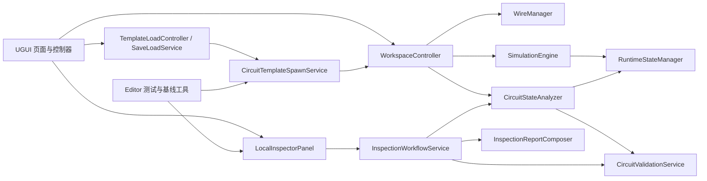

# 架构地图

## 分层关系

## 职责边界

| 层 | 主要职责 | 方向与约束 |
|---|---|---|
| UGUI 控制器 | 页面呈现、事件绑定、数据渲染 | 不得成为电气事实来源。 |
| `WorkspaceController` | 活动元件、活动导线、选择、历史、仿真生命周期 | 所有电气服务应使用工作区集合，不能扫描全场景。 |
| 模板与保存加载 | 校验/序列化 DTO，并生成到工作区 | 标准模板与用户图纸入口不同。 |
| `CircuitStateAnalyzer` | 推导拓扑与电气状态快照 | 高风险核心；不渲染报告、不修改场景。 |
| `SimulationEngine` + `RuntimeStateManager` | 推进受支持运行态 | 管理 KT、FR、运动和接触器等可变状态。 |
| `CircuitValidationService` + Helper | 产出稳定规则问题 | RuleId 和 Severity 是契约数据。 |
| Inspector | 编排报告并渲染结构化 Block | 流程不依赖 UGUI，面板负责 UGUI。 |
| Editor 基线工具 | 运行真实模板并比较预期行为 | 验证时绝不能覆盖 expected。 |

## 核心文件交接表

| 文件 | 主要职责 | 依赖 | 调用方 | 风险 | 修改后必跑验证 |
|---|---|---|---|---|---|
| `Core/CircuitStateAnalyzer.cs` | 拓扑与状态推导 | 元件、导线、运行态 | Inspector、校验、工作区 | High | 规则测试、18 模板基线、运行态人工检查 |
| `Core/SimulationEngine.cs` | 单次仿真步进 | 活动图、运行态 | `WorkspaceController` | High | 工业运行态模板、安全测试 |
| `Core/WorkspaceController.cs` | 活动图、历史、交互 | `WireManager`、UI、引擎 | 大部分应用流程 | High | 模板、保存加载、接线、撤销重做 |
| `Core/Validation/CircuitValidationService.cs` | 聚合规则 Helper | Analyzer 结果、活动图 | 检查器/Inspector | High | 全部规则测试、18 模板基线 |
| `AI/LocalInspectorPanel.cs` | Inspector UGUI 与渲染 | Workflow、工作区 | Demo UI | Medium | 模型测试、基线、Play Mode 报告 |
| `AI/InspectionWorkflowService.cs` | Check/Explain 流程编排 | 适配器、Analyzer/规则/格式化器 | Inspector 面板 | Medium | 模型测试、18 模板基线 |
| `AI/InspectionReportComposer.cs` | 结构化报告 Block | 报告数据、校验问题 | Workflow/面板 | Medium | 模型测试、快照比较 |
| `Templates/CircuitTemplateSpawnService.cs` | 校验并生成真实模板 | DTO、目录、工作区 | 模板加载器/Editor 基线 | High | 18 模板、模板完整性 |
| `UI/SaveLoadService.cs` | 用户图纸持久化 | 工作区、目录、文件系统 | 保存加载 UI | High | 保存、加载、导入、兼容性 |
| `Editor/ArchitectureBaselineSnapshotWriter.cs` | 生成/验证回归证据 | 真实模板路径、Inspector | 测试菜单 | Medium | 模型测试、18 模板验证 |

## 控制器装配原则

项目同时存在场景序列化的 UI 外壳和运行时创建 UI。控制器必须复用既有外壳或保证创建幂等；不能因一次 `Find` 失败就新增第二个控制器、第二套对象或重复监听器。
